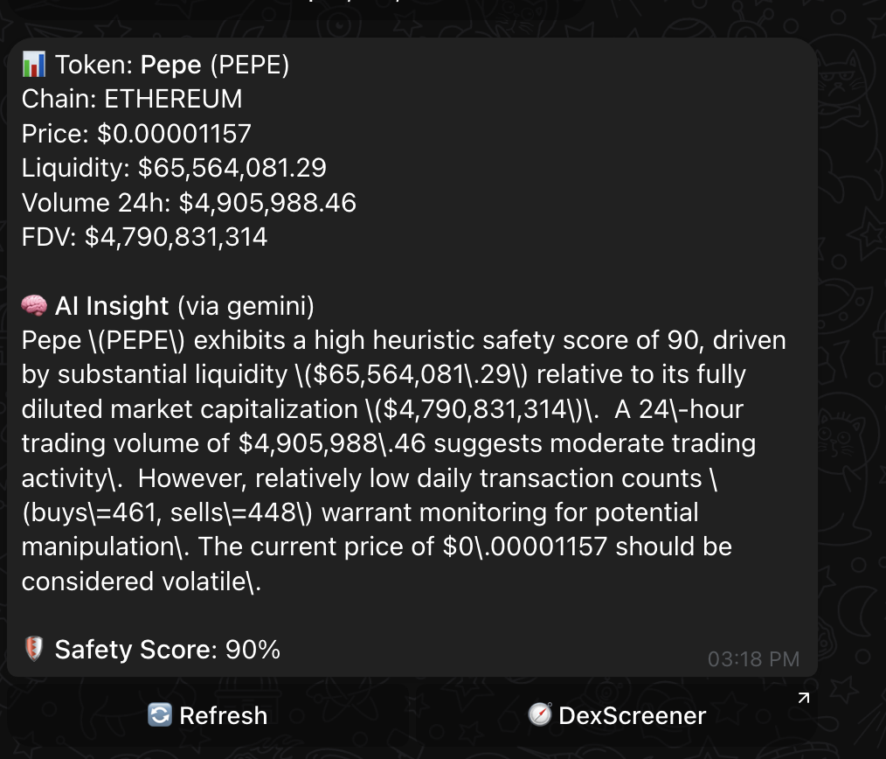

# 🛡️ Crypto Safety Telegram Bot

[](https://www.typescriptlang.org/)
[](https://js.langchain.com)
[](https://github.com/telegraf/telegraf)
[](https://www.prisma.io/)

A Telegram bot that helps users detect **red flags** and understand **token safety** instantly from just a symbol or contract address.

---

## 🧠 What Can This Bot Do?

| Input Type         | Example           | Result                                             |
|--------------------|-------------------|----------------------------------------------------|
| `/price BTC`       | BTC               | Market data + liquidity score                      |
| `/analyze <0x…>`   | Contract address  | AI analysis + safety score                         |
| Freeform text      | "price of pepe"   | Symbol extraction → price → analyze button         |
| Paste contract     | `0xABC…`          | Auto analyze + explanation                         |

---

## 📸 Screenshots

| Analyze Button | AI Result |
|----------------|-----------|
|  |  |


---

## ⚙️ Tech Stack

- **Node.js + TypeScript**
- **Telegraf** (Telegram Bot API)
- **LangChain** for AI summarization
- **OpenAI / Gemini** — configurable
- **CoinGecko + Dexscreener** for live token data
- **Fastify** (for webhook + REST)
- **Prisma + PostgreSQL** for logs, settings, caching

---

## 🚀 Commands Overview

| Command            | Description                                  |
|--------------------|----------------------------------------------|
| `/start`           | Intro message                                |
| `/help`            | Show all commands                            |
| `/price <symbol>`  | Get price + liquidity + market stats         |
| `/analyze <0x…>`   | Analyze token safety via AI                  |
| `/settings`        | Show current chat preferences                |
| `/setchain <eth>`  | Set preferred chain (ETH, BSC, etc)          |
| `/provider <...>`  | Set AI: `openai`, `gemini`, or `auto`        |
| `/logs`            | Show recent queries by this user             |

---

## 🧪 Freeform Handler

Supports raw inputs like:

- `btc`, `pepe`, `solana`
- `$DOGE`, `$pepe`, `price of eth`
- `0x…` contract — direct analyze

Uses:
- Symbol resolver
- On-chain pair matcher
- Interactive inline buttons
- AI summarizer

---

## 🧠 LangChain Prompt Logic

```
You are an analyst. Explain the safety of a crypto token for a retail user.
Be neutral and specific. Use these metrics:
- Price: $…
- Liquidity: $…
- Volume (24h): $…
- FDV: $…
- Buys/Sells: 100/50
Return a JSON:
{
  score: …,
  explanation: …
}
```

## 🧪 How to Run Locally

> Requires: `Node.js`, `npm`, `PostgreSQL`, `.env` file.

1. **Install deps**

```
npm install
```
2. Set up your .env

✅ Commit a .env.example (no secrets) for future contributors.


3. Generate Prisma client & migrate
```
npx prisma generate
npx prisma migrate dev --name init
npx prisma studio // optional explore DB use GUI

```

4. Start bot in dev mode
```
npm run dev:bot

```
5. Start server (Fastify webhook mode)
```
npm run dev:server
```

### Webhook Mode (for deploy or ngrok)
```
ngrok http 5555
```

### Then set in .env:
```
BOT_MODE=webhook
PUBLIC_URL=https://abc123.ngrok.io
```

### And run:
```
npm run api:dev
```

## REST API Endpoints

| Endpoint           | Description              |
| ------------------ | ------------------------ |
| `GET /health`      | Check bot is alive       |
| `GET /token/:addr` | Trigger analyze from API |


## Scripts 

| Script            | Description                            |
| ----------------- | -------------------------------------- |
| `dev:bot`         | Build and run bot directly             |
| `dev:server`      | Run Fastify webhook server             |
| `build`           | Compile TypeScript and generate Prisma |
| `studio`          | Launch Prisma Studio (GUI for DB)      |
| `prisma:generate` | Regenerate Prisma client               |
| `type-check`      | Check TypeScript types                 |

## Database model

```
model QueryLog {
  id        BigInt   @id @default(autoincrement())
  chatId    BigInt
  type      String
  input     String
  outcome   String?
  latencyMs Int?
  provider  String?
  cacheKey  String?  @db.Text
  createdAt DateTime @default(now())
}

model PriceCache {
  key       String   @id
  payload   Json
  updatedAt DateTime @updatedAt
}

model DexCache {
  key       String   @id
  payload   Json
  updatedAt DateTime @updatedAt
}

model ChatSetting {
  chatId       BigInt   @id
  defaultChain String?
  provider     String?
  updatedAt    DateTime @updatedAt
}

```
## Folder Structure
```
.
├── src/
│   ├── bot/              → Telegram bot handlers
│   ├── llm/              → LangChain prompt logic
│   ├── utils/            → Logging, caching, token parsing
│   ├── server.ts         → Fastify webhook setup
│   └── index.ts          → Bot entrypoint
├── prisma/
│   ├── schema.prisma     → DB schema (query logs, cache)
├── dist/                 → Compiled JS
├── .env
├── package.json
└── README.md
```

# Security Notes

Retry on CoinGecko rate limits (429 / 5xx).
Input sanitization for commands.
Short cache TTLs (45s) to reduce spam.
Prisma logs inputs, errors, and outcomes in queryLog.

# Deployment tips

| Platform | Guide                                    |
| -------- | ---------------------------------------- |
| Railway  | Add secrets, set port, deploy            |
| Render   | Use Web Service mode + PostgreSQL Add-on |
| Fly.io   | Fastify-friendly + persistent volumes    |

```
npx prisma migrate deploy

```
start production
```
npm run build
npm run start

```

# TODO / Ideas

- Add unit tests with Jest or Vitest.
- Dockerize for easy deployment.
- Add admin dashboard (see query logs).
- AI-based risk scoring engine.
- User settings (preferred chains, alerts).

# Contributing

Want to improve this bot or adapt it for your own project? Feel free to fork and modify it. PRs welcome!

# Demo

# Author

Built with ❤️ by **[Kelvin Prajnawi](www.linkedin.com/in/kelvin-prajnawi-7b5851177)**
